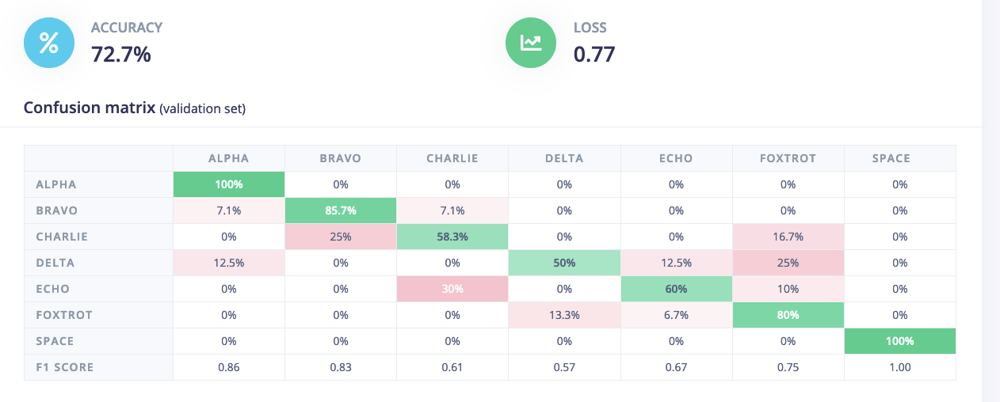

# Table of Contents
* Abstract
* [Introduction](#1-introduction)
* [Related Work](#2-related-work)
* [Technical Approach](#3-technical-approach)
* [Evaluation and Results](#4-evaluation-and-results)
* [Discussion and Conclusions](#5-discussion-and-conclusions)
* [References](#6-references)

# Abstract

Our project is to investigate an embedded systems-based methodology for identifiying a laptop or keyboard user's keystrokes. This project takes a hardware-based approach rather than a software-based approach to replicate a potential malicious attack on a user's computer. Our project is attempting to replicate vibrational-based sensing methods of machine learning identification problems investigated by research groups at Stanford, but to a smaller scale. In our project, vibrational sensors will be placed at the bottom of a laptop and/or keyboard and record vibrational patterns at multiple points of the laptop/keyboard chassis. Following this, a form of supervised or unsupervised learning model will be used to identify the keys that were pressed by the user and transmit those from a microcontroller to another device. The second device will then try to reconstruct the message that is being typed. Our goal is to have our system perform reasonably accurate keystroke identification such that a person separated from the keyboard may be able to deduce the information typed by the keyboard user.

# 1. Introduction

- Motivation & Objective: What are you trying to do and why? (plain English without jargon)
State of the Art & Its Limitations: How is it done today, and what are the limits of current practice?

- Novelty & Rationale: What is new in your approach and why do you think it will be successful?

- Potential Impact: If the project is successful, what difference will it make, both technically and broadly?

- Challenges: What are the challenges and risks?

The overall goal of our project is to demonstrate a side channel attack where keystroke information can be inferred from its resulting vibration. We want to be able to detect individual key-press events from vibration data and record that data for training and classification. We also want to deploy an edge-based machine learning for key press classification. Finally, we want to communicate our classifications to a second device to verify classifications can be read by another user to represent malicious keylogging.

The specific steps needed to complete a system that has the ability to classify vibration based key presses was logically broken into three separate systems. The embedded system, the machine learning model, and secondary device, each with their separate metrics of success.

Our embedded system must have the ability to CONTINUOUSLY:
1. Detect vibration events. In this case the vibration events are key presses and only key presses.
2. Record key press event sensor data for further use (classification/training) at a high sampling rate
3. Deploy an edge-based machine learning model
4. Communicate classifications to a secondary device

Our machine learning model must have the ability to:
1. Process and scale data for classification
2. Perform classification of keypresses with high accuracy (>65%) on raw sensor data

Our secondary device must have the ability to:
1. Accept classification data from the embedded device 
2. Decipher the received data and display it as human-readable words to represent keylogging

# 2. Related Work

# 3. Technical Approach

### 3.a. Vibration Sensing and Amplification
The most basic requirement of the project is the ability to detect vibrational data from key presses. To achieve this, four contact microphones were attached to the back of the keyboard. These contact microphones originally had a very low power output so an amplifier was used to amplify the signal approximately 10 times in the passband.

Figure 1. Contact Microphones Attached to Keyboard

Figure 2. Amplifier Design for 10x Gain of Microphone Signal

Figure 3. ESP32 ADC Block Diagram

Next, the sensor data needed to be read and recorded by our embedded device. In order to achieve this one of the ESP32’s four ADCs were used. Originally the RTC ADC was used because it was accessible; however, the RTC ADC operates in the low power domain which means it is optimized for low power consumption. The RTC ADC configuration was subsequently abandoned for the DIG ADC. The DIG ADC is optimized for speed and throughput, leverages the I2S DMA to write samples directly to memory, and generates an interrupt when sampling is finished. Furthermore, there is a pattern table which can take up to 16 specific ADC commands. We leveraged this to read each four of our sensors in a round robin fashion.

Figure 4. Embedded Device Program Flow

Once sensor data is amplified and read, it needs to be sorted, qualified, scaled, and deployed. Each sample when read from memory is tagged with the channel it was read from. By leveraging this tag, each sample can be added to its respective queue and quickly sorted. The data also needs to be qualified as a keypress by measuring the average energy. This is done by squaring and summing all the sensor reading. Though not strictly necessary a baseline is subtracted from the sensor's value reading. This stops the energy level from becoming exceptionally high. Finally the data needs to be scaled and deployed. In this case we are scaling the data from 16 bit value to an 8 bit value and subtracting 50 from it. The shift from 12 bit data to 8 bit data is performed for compatibility with old training data. The subtraction of 50 was found experimentally and performs better in the edge impulse model than our unscaled data. The data is now ready to be fed into the machine learning model or offloaded for training.

### 3.b. Classification of Key Localization from Sensor Data
Once the data is scaled and properly formatted, all the data is provided to a new project in Edge Impulse Studio, a service that offers drag-and-drop design processes for signal processing and machine learning for embedded systems projects. Each sample keypress’s sensor data was provided to Edge Impulse through CSV files. 

Because contact microphones inherently deal with vibrational data, we were interested in looking at the frequency spectrum energies within the entire window of the vibrational keypress event. For this reason, we decided to use the spectral analysis and spectrogram signal processing blocks that Edge Impulse provides for us, in addition to using the raw data itself. 

The spectral analysis block takes windowed FFTs of a given size for each sensor in our raw data and calculates the overall energy of the frequency bins given by the FFT for each sensor across the sampling window. We found an optimal performance in separating features of the raw data when using a 256 point FFT across our sampling window of roughly 1 second. This causes some feature separation that makes it more distinguishable for a model to discern the different output classes.

Figure 5. Feature Scatter Plot for Classification of Spectral Analysis Data

Spectrograms, alternatively calculate FFT energies for given framed lengths of time within the sampling window and a specific stride of time between each energy calculation. Through trial and error, we found that optimal performance occurred when a 32 point FFT was applied to 20 millisecond frames and frames were spaced 30 milliseconds apart. 

Figure 6. Example Output Spectrogram

Because we used 4 sensors, and each sensor had a set of feature vectors from the raw data, spectral analysis, and spectrogram, we decided to use a basic two layer 2D convolutional neural network to classify the data, treating each sensor as if it's a dimension of an image. Our convolutional network’s first layer had a convolutional/pool kernel size of 3 and 16 filters. The second layer used a convolutional/pool kernel size of 3 and 8 filters. Each convolutional/pool layer had a dropout of 0.1 applied after them to reduce overfitting. Reshape and flatten layers are added to the inputs and outputs of the model, respectively to ensure proper dimensioning from input to output.

Figure 7. Final Neural Network Architecture

Originally, we attempted to test this type of model on its own to classify what key was pressed on the embedded device. However, in our initial tests, this resulted in poor classification of 5%. Because of this poor accuracy, we attempted to classify localized areas of the keyboard instead of individual keys. This was a great success compared to individual keys, as our initial model’s test accuracy jumped to 17%. Because of this, we decided to move from classifying keys on target and move to classifying localized areas and communicate those areas to another device to run a word prediction model, which will be discussed in the next section. 

Figure 8. Initial Classification Accuracy Classifying for Individual Keys

Figure 9. Initial Classification Accuracy Classifying for Localized Keyboard Areas

Through trial and error of the parameters of the signal processing blocks and by reassigning the localization areas based on the location of the sensors on the keyboard, we eventually managed to achieve a model accuracy of 72%, which we felt was sufficient to pass to a secondary model off-target to perform probabilistic word prediction. Furthermore, because our final model showed 100% accuracy at classifying the spacebar, this reaffirmed that we could use a probabilistic word prediction model since we would know when every word started and stopped.

Figure 10. Final Classification Accuracy of CNN Model

### 3.c. Word Prediction Model

# 4. Evaluation and Results
Evaluating our system became a difficult challenge when we first attempted to deploy our Edge Impulse model on our embedded device. We found that for a given raw data sample that we knew to be in our training and test data, the classification that was given to that data point was different between Edge Impulse Studio and the on-target library that Edge Impulse generated. This situation occurred for both an ESP32 and an Arduino.

Figure 11. Classification of test sample in Edge Impulse Studio. We can see that the alpha sample (noted by the first word in the sample name) is very confidently classified as alpha

Figure 12. Classification of same test sample in generated Arduino library

Through discussing with a team member at Edge Impulse using their support page, we were told that this issue was a bug in Edge Impulse’s C++ SDK, and thus the poor classification on-target was an issue that was out of our control to fix and required an internal ticket to be developed for a still currently unresolved issue.

Despite this issue, we could still perform classification keypress events even though the classification may not be accurate. The video below shows an example of keypress events occurring and the resulting probabilities for each of the 7 localization areas printed to the terminal as a string.

Click the image above to open YouTube video demonstration

Our ESP32 could thus reliably determine when a keypress occurred and classify it as we expect it to. Furthermore, we can see that different keypresses did result in different classifications of localized areas, even if the results of those classification were nonsensical. If we were to operate under the assumption of a fully working on-target model, these classifications would be sufficient to pass to our word prediction model to result in accurate keylogging.

One point to note is that in our system, the source of the vibrational data may not have always been a keypress that triggered the classification. For example, banging the table caused enough environmental vibrational noise that the model considered it a keypress. 

Additionally, because of the bug in the on-device model classification, we could no longer rely on the spacebar identification to accurately define the breaking of words for our word prediction model. Therefore, we imposed a limit to our word prediction model in order to obtain a fully functioning system.

For our word prediction model, we first tested the model using static probability values for cluster localization classifications of predefined words. We tested the phrases "cut off", "crock pot", and "the cow jumped over the moon". We used Edge Impulse Studio to create a localization classification for each letter of each phrase and manually coded those probabilities into an array for each phrase. Running the model with these static values, we got the following results.

Figure 13. Word prediction from static probabilities of keyboard localization for the phrase "cut off"

Figure 14. Word prediction from static probabilities of keyboard localization for the phrase "crock pot"

Figure 15. Word prediction from static probabilities of keyboard localization for the phrase "the cow jumped over the moon"

We see that for the phrases "cut off" and "crock pot" the predicted words match exactly what we expect. Additionally, the predictive model is able to absorb occasional mispredictions in the keyboard localization model, as the context of the surrounding letters allows it to choose the best fitting word for the context.

As for the phrase "the cow jumped over the moon" the predicted phrase only replaced "cow" for "air". What we found here is that because the localizations in the word "air" perfectly overlap the localizations in the word "cow", the more probable phrase that was returned by the model based on the key clustering was "the air". This shows a flaw in our current system of two-word classification in that the model only picks the most probable two-word pairs, leaving out information of other pairs. Additionally, the larger context of the sentence is not able to contribute to the classification of previous words.

The video below shows a full demonstration of the embedded keypress system communicating with the off-target model. As mentioned before, we imposed a limitation to the word model since we could no longer trust the spacebar classification to separate words. The limitation we imposed is to assume all words are 4 letters long. As shown in the video below, we see that the system registers individual keypresses and after 4-8 keypresses it classifies single or two-word pairs, respectively. This leads us to believe that under a functioning edge model for keyboard localization, we would be able to achieve high accuracy predictions of typed words.

Click the image above to open YouTube video demonstration

# 5. Discussion and Conclusions

Despite the Edge Impulse bug the project was still a relative success. The ESP32 seemed like a solid choice for this project and its ADC is capable of much more than what we were doing with it, however this was due largely to luck. In retrospect it would have made sense to evaluate the platform choice with more rigor. For example, had the ESP32 not had a capable DIG ADC we would have been forced to change platforms. Furthermore, choosing a platform with bluetooth included in the SOM would have let us achieve more potential project goals as our platform only had WiFi capabilities.

Unfortunately due to time constraints we did not have the option to look into deploying other machine learning models besides our Edge Impulse based model. Having more time, potential would have potentially allowed us to build a TensorFlow Lite model and achieve similar results to our undeployed edge impulse model.

Paragraph about success of word prediction model

Paragraph about doing the same thing with an IMU because he seemed hell bent on it

# 6. References
